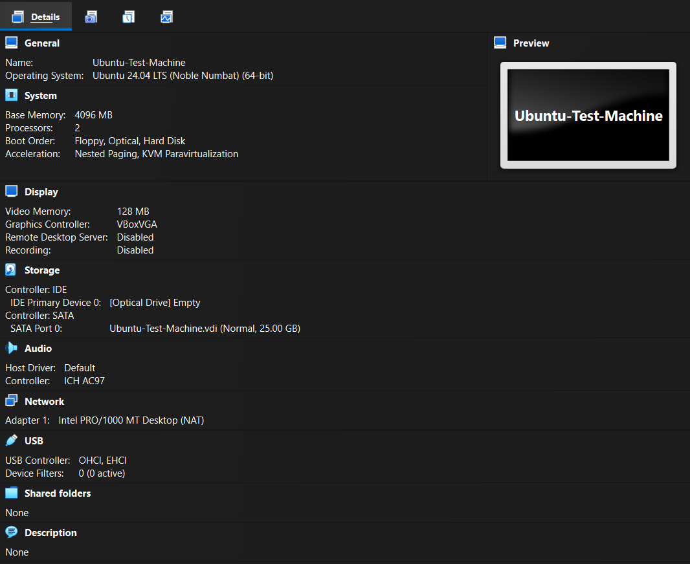
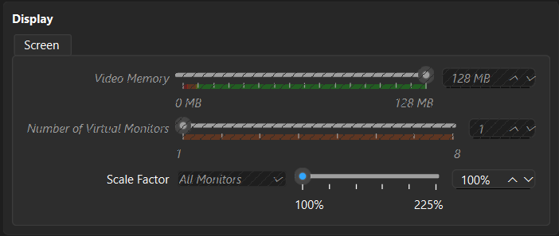
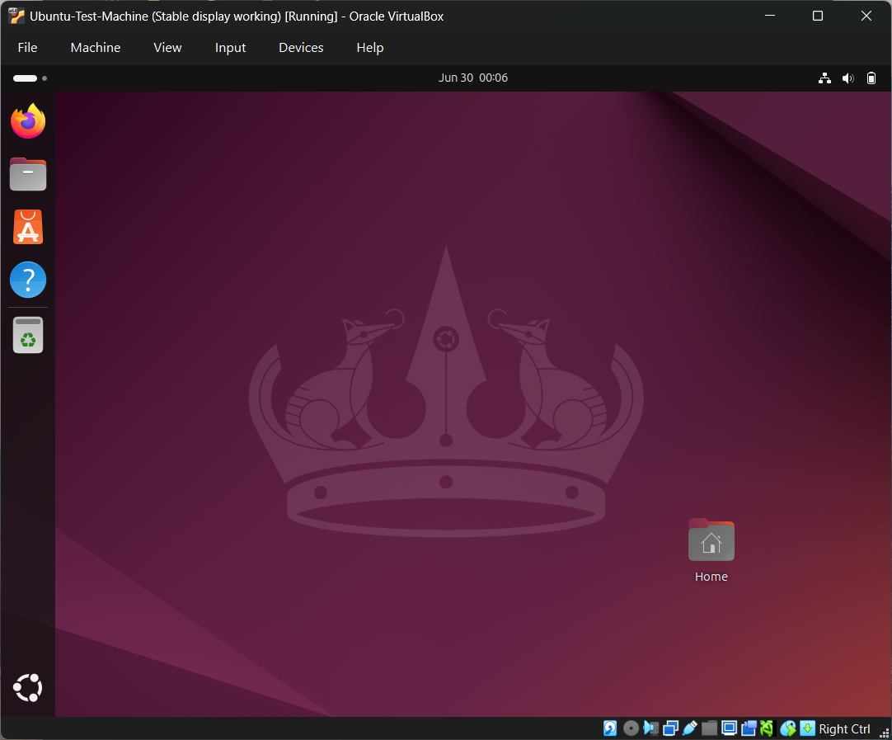
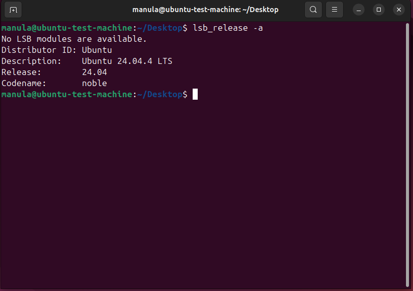
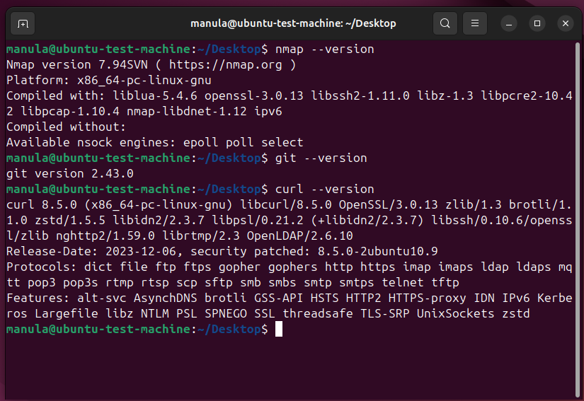
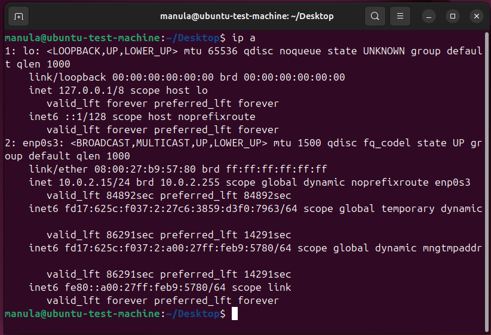
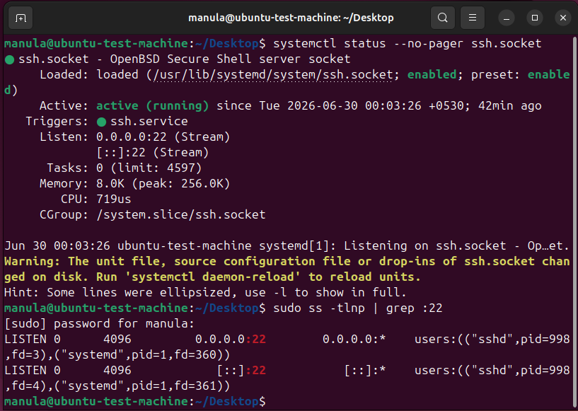
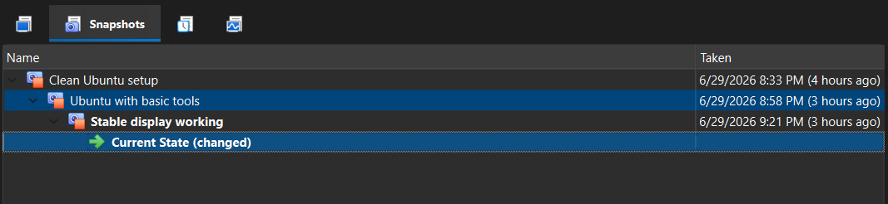

# Day 02 – Ubuntu VM Setup

## Objective

Set up an Ubuntu virtual machine in VirtualBox for cybersecurity lab practice.

## VM Configuration

| Setting | Value |
|---|---|
| Virtualization software | Oracle VirtualBox |
| Guest OS | Ubuntu 24.04.4 LTS |
| RAM | 4096 MB |
| CPU | 2 processors |
| Disk | 25 GB virtual disk |
| Network | NAT |
| Video memory | 128 MB |
| Graphics controller | VBoxSVGA |

## Installation Summary

Ubuntu was installed manually using the interactive installer.

Selected options:

- Ubuntu 24.04.4 LTS Desktop ISO
- Interactive installation
- Default application selection
- No third-party proprietary software
- Erase disk and install Ubuntu inside the VirtualBox virtual disk

The “Erase disk” option applied only to the VM’s virtual disk, not the host Windows system.

## Display Issue and Fix

During the initial setup, the VM showed a black screen after boot/login.  
The issue was fixed by changing VirtualBox display settings and using the working graphics configuration.

Final working setup:

- Video memory: 128 MB
- 3D acceleration: disabled
- Stable display configuration saved as a VirtualBox snapshot

## Installed Tools

The following tools were installed:

```bash
sudo apt install nmap net-tools curl git openssh-server -y
```

Verified tools:

```bash
nmap --version
git --version
curl --version
```

## Network Verification

The VM network interface was checked using:

```bash
ip a
```

The VM received a NAT IP address from VirtualBox.

## SSH Verification

SSH socket was enabled and verified using:

```bash
systemctl status --no-pager ssh.socket
sudo ss -tlnp | grep :22
```

SSH was listening on port 22.

## Snapshots Created

VirtualBox snapshots created:

1. Clean Ubuntu setup
2. Ubuntu with basic tools
3. Stable display working

## Screenshots

### VirtualBox VM Details



### Working Display Settings



### Ubuntu Desktop Running



### Ubuntu Version



### Basic Tools Installed



### Network Interface



### SSH Socket Active



### VirtualBox Snapshots

