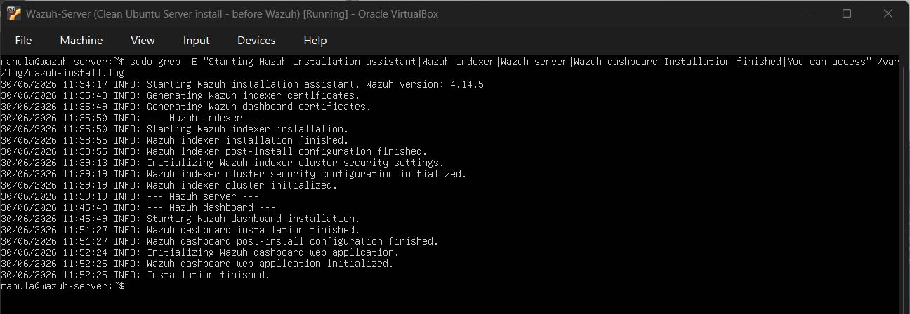
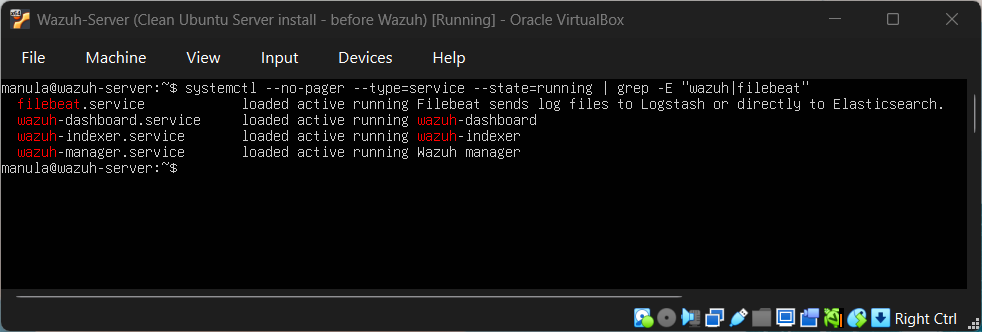
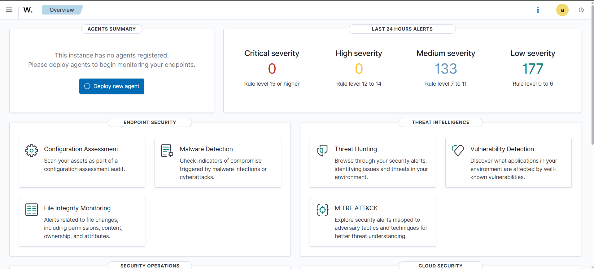

# Day 03 – Wazuh Server Setup

## Objective

Set up the Wazuh server VM and verify that the Wazuh dashboard is accessible from the host machine browser.

## VM Configuration

| Setting                 | Value                     |
| ----------------------- | ------------------------- |
| Virtualization software | Oracle VirtualBox         |
| VM name                 | Wazuh-Server              |
| Guest OS                | Ubuntu Server 24.04.4 LTS |
| RAM                     | 8192 MB                   |
| CPU                     | 4 processors              |
| Disk                    | 50 GB virtual disk        |
| Network Adapter 1       | NAT                       |
| Network Adapter 2       | Host-only Adapter         |
| NAT IP address          | 10.0.2.15                 |
| Host-only IP address    | 192.168.56.10             |

## Pre-installation Verification

Before installing Wazuh, the server was checked to confirm that Ubuntu Server, networking, memory, and disk space were working correctly.

Commands used:

```bash
lsb_release -a
ip a
free -h
df -h
```

Verified results:

* Ubuntu Server 24.04.4 LTS installed
* NAT network available for internet access
* Host-only IP address configured as `192.168.56.10`
* Around 8 GB RAM available for Wazuh
* Around 50 GB virtual disk allocated

A VirtualBox snapshot was created before installing Wazuh:

```text
Clean Ubuntu Server install - before Wazuh
```

## Wazuh Installation

The Wazuh installation assistant was downloaded and executed on the Wazuh server VM.

Commands used:

```bash
sudo apt update
curl -L -o wazuh-install.sh https://packages.wazuh.com/4.14/wazuh-install.sh
sudo bash wazuh-install.sh -a
```

The installation completed successfully.

The generated Wazuh admin password was saved privately and was not uploaded to GitHub.

## Service Verification

After installation, the Wazuh-related services were checked.

Command used:

```bash
systemctl --no-pager --type=service --state=running | grep -E "wazuh|filebeat"
```

Verified running services:

* `wazuh-manager.service`
* `wazuh-indexer.service`
* `wazuh-dashboard.service`
* `filebeat.service`

## Dashboard Access

The Wazuh dashboard was accessed from the Windows host browser using the host-only IP address:

```text
https://192.168.56.10
```

A browser certificate warning appeared because the dashboard uses a self-signed certificate in this lab environment. This was expected.

The dashboard login page loaded successfully, and login was completed using the admin credentials generated during installation.

## Result

Wazuh server installation was completed successfully.

Confirmed results:

* Wazuh server installed
* Wazuh services running
* Wazuh dashboard accessible from the host browser
* Admin password saved privately
* Dashboard home page loaded successfully

## Screenshots

### Wazuh Installation Finished



### Wazuh Services Running



### Wazuh Dashboard Login


### Wazuh Dashboard Home



## Snapshot

After confirming that the dashboard was accessible, a new VirtualBox snapshot was created:

```text
Wazuh installed and dashboard accessible
```

## Notes

At this stage, no Wazuh agents have been added yet. The next step is to enroll the Ubuntu test machine as a Wazuh agent so endpoint logs can be collected and monitored.