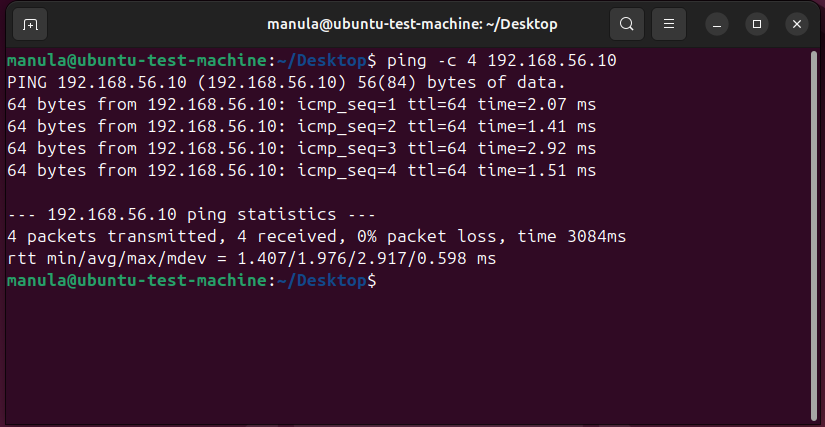
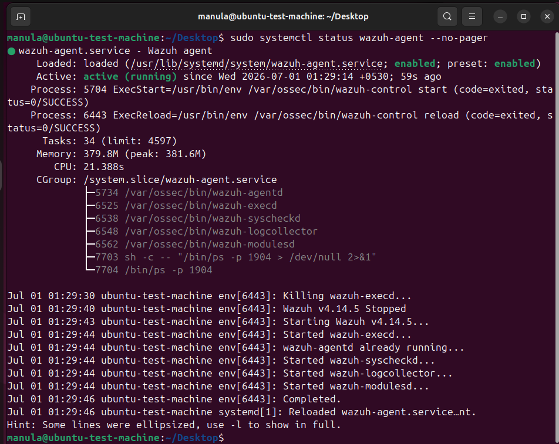
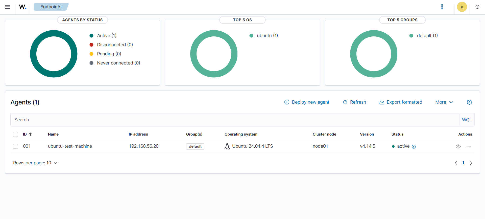
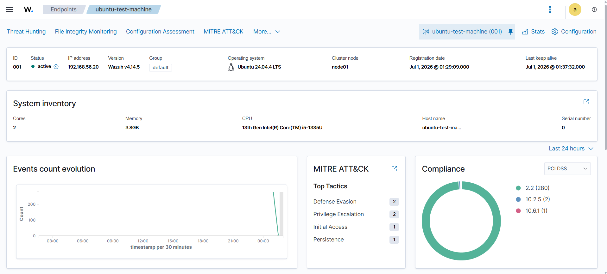

# Day 04 – Ubuntu Agent Enrollment

## Objective

Connect the Ubuntu Test Machine to the Wazuh Server and enroll it as a Wazuh agent.

This allows the Wazuh Server to collect and monitor security data from the Ubuntu endpoint.

## Lab Machines

| Machine             | Role                                  | IP Address    |
| ------------------- | ------------------------------------- | ------------- |
| Wazuh-Server        | Wazuh manager, indexer, and dashboard | 192.168.56.10 |
| Ubuntu-Test-Machine | Monitored Ubuntu endpoint             | 192.168.56.20 |

## Network Configuration

The Ubuntu Test Machine was configured with two network adapters:

| Adapter   | Type              | Purpose                    |
| --------- | ----------------- | -------------------------- |
| Adapter 1 | NAT               | Internet access            |
| Adapter 2 | Host-only Adapter | Internal lab communication |

The host-only adapter on the Ubuntu Test Machine was configured with the static IP address:

```text
192.168.56.20
```

The Wazuh Server was already configured with the host-only IP address:

```text
192.168.56.10
```

## Network Verification

Connectivity between the Ubuntu Test Machine and the Wazuh Server was tested using `ping`.

Command used on the Ubuntu Test Machine:

```bash
ping -c 4 192.168.56.10
```

The ping test completed successfully with 0% packet loss.

This confirmed that the Ubuntu endpoint could communicate with the Wazuh Server over the private host-only lab network.

## Wazuh Agent Installation

The Wazuh agent deployment command was generated from the Wazuh dashboard using:

```text
Endpoints → Deploy new agent
```

Selected options:

| Option           | Value               |
| ---------------- | ------------------- |
| Operating system | Linux               |
| Package type     | DEB amd64           |
| Server address   | 192.168.56.10       |
| Agent name       | ubuntu-test-machine |
| Agent group      | default             |

The generated command was run on the Ubuntu Test Machine.

Example command:

```bash
wget https://packages.wazuh.com/4.x/apt/pool/main/w/wazuh-agent/wazuh-agent_4.14.5-1_amd64.deb && sudo WAZUH_MANAGER='192.168.56.10' WAZUH_AGENT_NAME='ubuntu-test-machine' dpkg -i ./wazuh-agent_4.14.5-1_amd64.deb
```

## Agent Service Verification

After installation, the Wazuh agent service was enabled and started.

Commands used:

```bash
sudo systemctl daemon-reload
sudo systemctl enable wazuh-agent
sudo systemctl start wazuh-agent
sudo systemctl status wazuh-agent --no-pager
```

The service status showed:

```text
active (running)
```

This confirmed that the Wazuh agent was running successfully on the Ubuntu Test Machine.

## Dashboard Verification

The Wazuh dashboard was opened from the Windows host browser:

```text
https://192.168.56.10
```

The Ubuntu Test Machine appeared in the Wazuh dashboard as an active agent.

Verified details:

| Field               | Value               |
| ------------------- | ------------------- |
| Agent ID            | 001                 |
| Agent name          | ubuntu-test-machine |
| Status              | active              |
| IP address          | 192.168.56.20       |
| Operating system    | Ubuntu 24.04.4 LTS  |
| Wazuh agent version | 4.14.5              |
| Group               | default             |

## Result

The Ubuntu Test Machine was successfully enrolled as a Wazuh agent.

Confirmed results:

* Ubuntu Test Machine connected to the host-only lab network
* Ubuntu Test Machine assigned IP address `192.168.56.20`
* Wazuh Server reachable at `192.168.56.10`
* Wazuh agent installed successfully
* Wazuh agent service running
* Ubuntu endpoint visible as an active agent in the Wazuh dashboard

## Screenshots

### Ubuntu Host-only Network Verification



### Wazuh Agent Running



### Ubuntu Agent Active in Wazuh Dashboard



### Agent Details



## Snapshots

After confirming that the Ubuntu endpoint was active in Wazuh, snapshots were created for recovery.

| VM                  | Snapshot name                   |
| ------------------- | ------------------------------- |
| Ubuntu-Test-Machine | Ubuntu connected to Wazuh agent |
| Wazuh-Server        | Ubuntu agent enrolled           |

## Notes

At this stage, the Ubuntu endpoint is successfully connected to Wazuh.

The next step is to generate safe test activity and verify that Wazuh can collect and display security-related events from the Ubuntu endpoint.